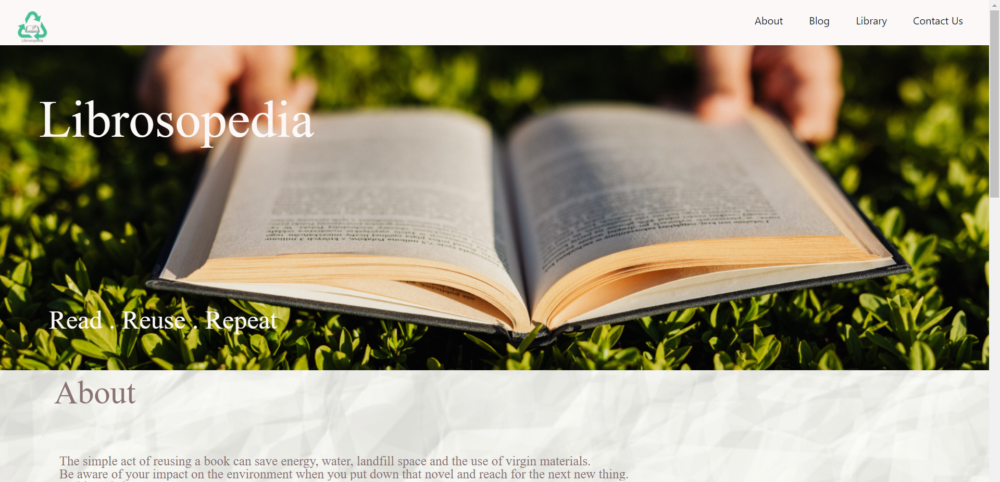
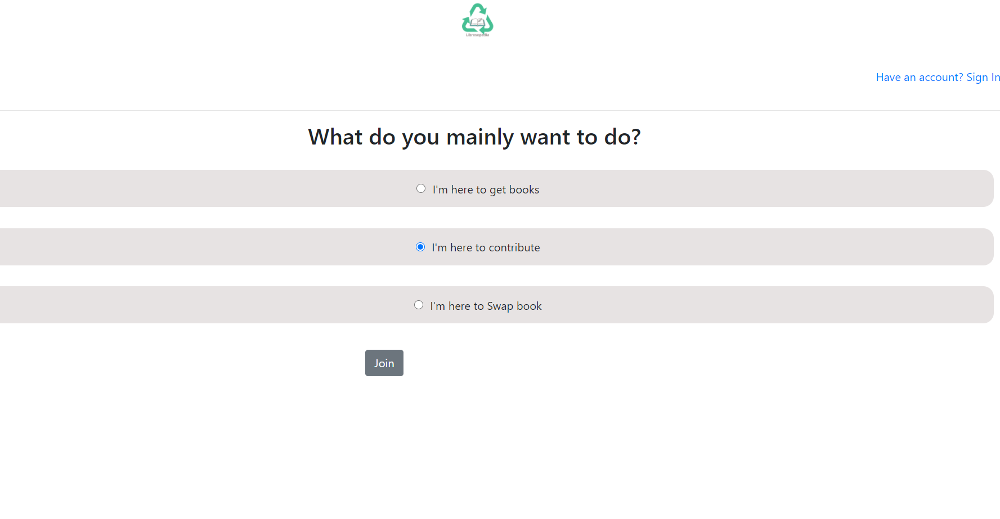
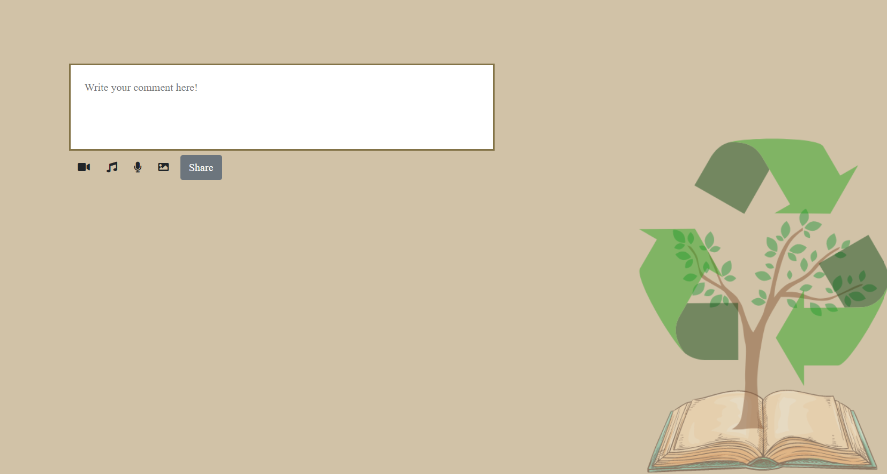
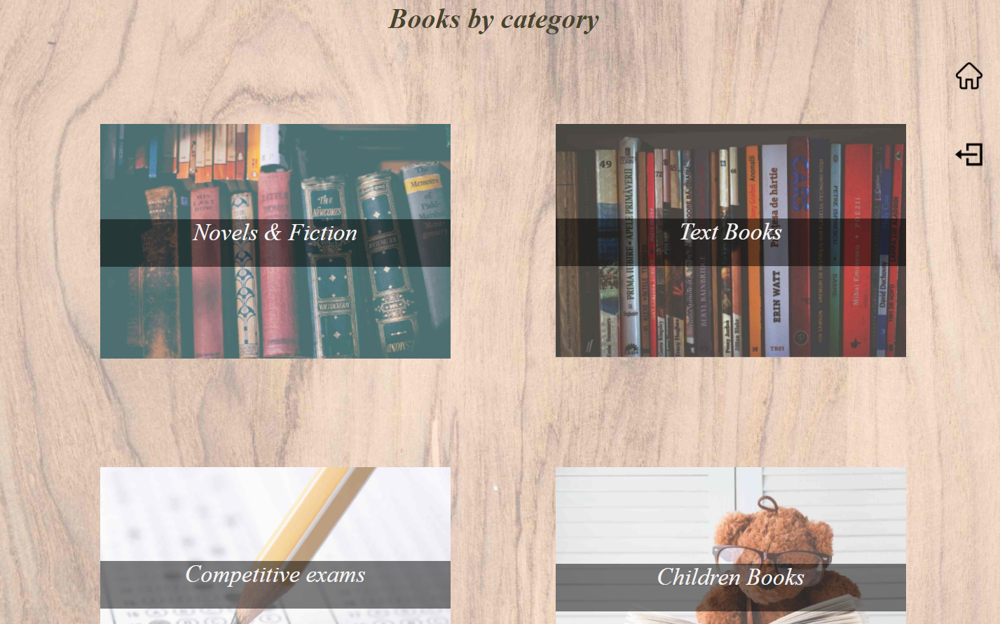
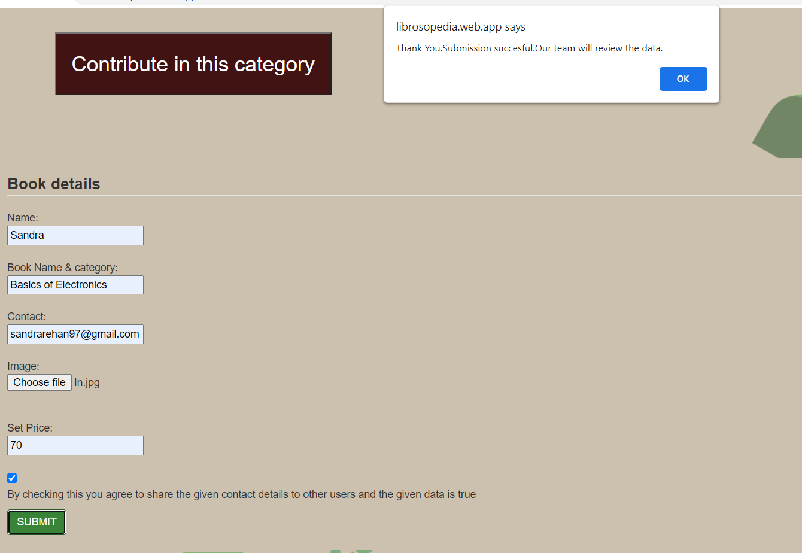
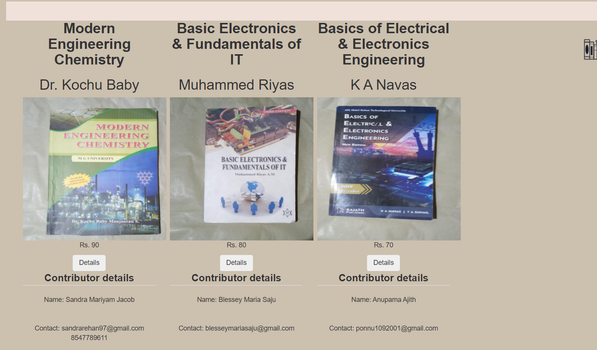

# Librosopedia
A simple web app to swap and contribute used books.
Our project is based on UN SDGs 4 and 15.
We aim to form a community for promoting the reuse of books.Thereby we can save a lot more trees from destruction.
 

For every academic term or semester, thousands of new textbooks are being printed, bought and used. On the other hand, almost the same number of textbooks and course material are being discarded after its use and find its way to the garbage bins ultimately landing at the landfill site where they are being buried, compacted and disposed occupying precious land area.

We need to understand that it takes around three tons of trees to make one ton of paper which also utilize huge quantity of water per ton than any other product in the world. Paper making also produces high levels of air and water pollution which can be avoided. Each ton of recycled paper can save 17 trees and 7,000 gallons of water. It takes one tree to make 25 books. By recycling our books, we are giving that tree a new purpose and reducing deforestation.

Moreover, we think that we can support students from developing countries like India by providing books at an affordance price.

## The tagline is Read Reuse Repeat

 User can join the community to get/contribute/swap used books.Joining is very simple,just signup using email or google account.

Everyone can share recycling ideas in our blog , without even joining (Signing Up).

Categorised details of books are available in the library page.

User can easily contribute their used books to others by filling the form.

Books with contributor details are provided on the site. So users can directly contact them. Only the expense for sending the book has to be remitted from the user.

